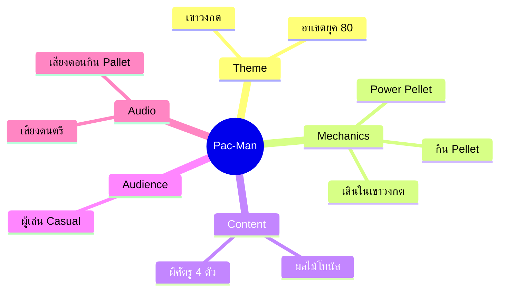
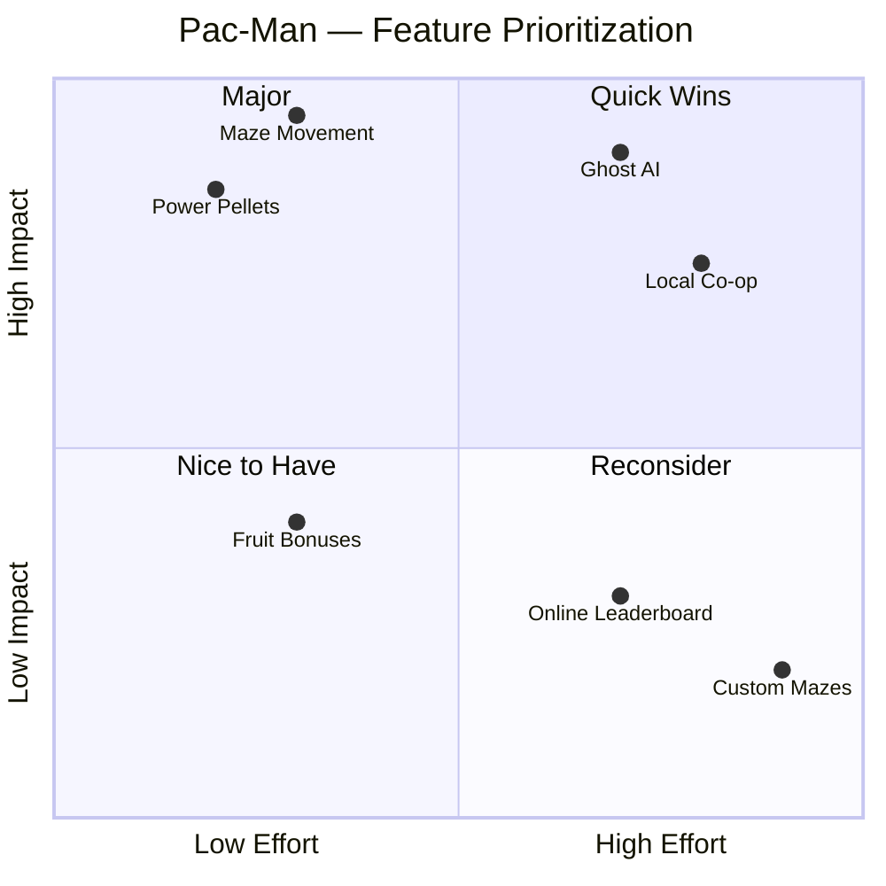
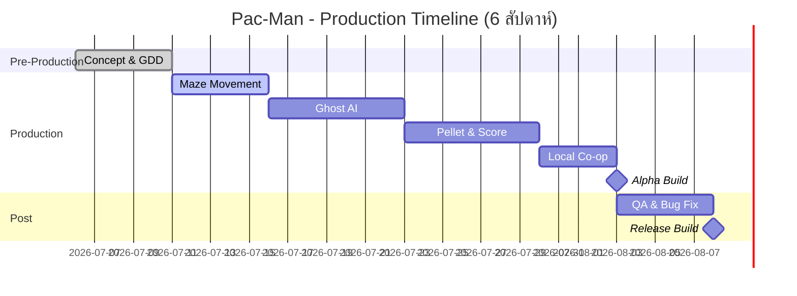

สรุป:

Features สำหรับ MVP (ซ้ายบน และ ขวาบน - High Impact): Maze Movement, Ghost AI, Power Pellets และ Local Co-op ควรนำมาทำเป็น MVP ก่อน เพราะเป็นหัวใจหลักของเกมและให้คุณค่ากับผู้เล่นสูง

Features ที่ควรตัดออกก่อน (ขวาล่าง - High Effort, Low Impact): Custom Mazes และ Online Leaderboard ควรตัดทิ้งหรือเก็บไว้ทำทีหลัง เพราะใช้แรงและเวลาในการทำมาก แต่ไม่ได้ส่งผลกระทบต่อความสนุกหลักของเกมมากนักในระยะเริ่มต้น



```

```
